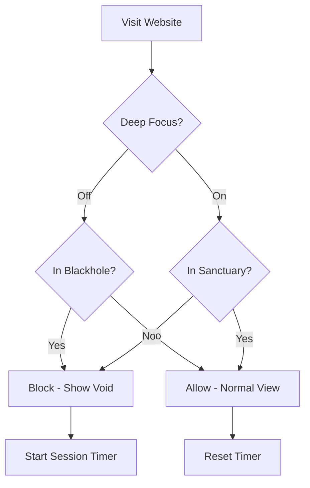

# Focus Engine | Pandemonium 🔮


[](https://www.tampermonkey.net/)
[](https://violentmonkey.github.io/)
[](https://www.greasespot.net/)
[](https://greasyfork.org/en/scripts/568636-focus-engine-pandemonium)

A high‑end site blocker that locks your browser into focus mode or whitelist‑only mode.  
Designed for deep concentration when you absolutely cannot afford distractions.

---

## 📋 Table of Contents

- [Features](#-features)
- [Safety & Assurance](#-safety--assurance)
- [Quick Start](#-quick-start)
- [How It Works](#-how-it-works)
- [Configuration](#-configuration)
- [Modes](#-modes)
- [FAQ](#-faq)
- [Support](#-support)
- [License](#-license)

---

## ✨ Features

| | |
|---|---|
| 🔮 **Dual Modes** | Blackhole (block list) or Sanctuary (allow list) |
| ⏱️ **Session Timer** | Tracks time spent in blocked sites automatically |
| 🚫 **Void Overlay** | Full‑screen takeover with live timer and quick actions |
| ⌨️ **Hotkey** | `Alt + S` opens control panel from any page |
| 💾 **Persistent** | Settings saved locally – survives browser restarts |
| 🔄 **Auto Migration** | Cleans up old version data automatically |

---

## 🛡️ Safety & Assurance

Transparency is our priority.

✅ **100% Open Source** – Full code in [`main.js`](main.js) for inspection  
✅ **No Data Collection** – Zero analytics, tracking, or external requests  
✅ **Minimal Permissions** – Only essential `GM_*` functions  
✅ **Community Trusted** – Used by hundreds of focus seekers

> All settings stay in your browser. We don't see anything.

---

## 🚀 Quick Start

### 1. Install a Userscript Manager

Choose one:
- [Tampermonkey](https://www.tampermonkey.net/) (Chrome, Firefox, Edge, Opera, Brave) – *recommended*
- [Violentmonkey](https://violentmonkey.github.io/) (Chrome, Firefox)
- [Greasemonkey](https://www.greasespot.net/) (Firefox)

### 2. Install the Script

You have three convenient options to install:

**Option A – Install from GreasyFork** (Recommended for most users)  
👉 Visit the official script page and click the install button:  
[**Focus Engine on GreasyFork**](https://greasyfork.org/en/scripts/568636-focus-engine-pandemonium)

**Option B – Direct Install from GitHub**  
👉 [Click here to install](https://github.com/ishaansucksatlife/Focus-Engine-Pandemonium/raw/main/main.js) directly from the source.

**Option C – Manual Install**  
- Copy the entire code from [`main.js`](main.js)
- Create a new script in your manager and paste the code.

### 3. Start Focusing

Press `Alt + S` on any website to open the control panel and begin configuring.

---

## ⚙️ How It Works



- **Keywords** match partially and case-insensitively  
  `reddit` → blocks `reddit.com`, `www.reddit.com`, `old.reddit.com`
- **Timer** starts when first blocked site appears; stops when you leave

---

## 🎛️ Configuration

### Control Panel (`Alt+S`)

| Tab | What You Can Do |
|-----|-----------------|
| **Flow State** | View current site status, timer, toggle Deep Focus, absorb/release current site |
| **Blackhole** | Add/remove sites to block (when Deep Focus OFF) |
| **Sanctuary** | Add/remove sites to protect (when Deep Focus ON) |

### Buttons & Actions

- **Add Current Site** – instantly add the domain you're on
- **Remove Current Site** – remove it from the list
- **Absorb/Release** – toggle current site in/out of active list
- **Clear All** – wipe entire list
- **LED Indicator** – shows mode at a glance (cyan = normal, green = Deep Focus)

---

## 🧩 Modes

| Mode | Behavior |
|------|----------|
| **Blackhole** | Blocks sites in your Blackhole list. Everything else allowed. |
| **Sanctuary** | **Only** sites in Sanctuary allowed. Everything else blocked. |
| **Deep Focus** | Toggle between the two modes with one click. |

---

## ❓ FAQ

<details>
<summary><b>Why is a site blocked that I didn't add?</b></summary>
Check if Deep Focus is ON – that means only Sanctuary sites are allowed. Also verify partial matches: "tube" might block "youtube.com" accidentally.
</details>

<details>
<summary><b>How do I reset everything?</b></summary>
Open browser console (F12) and run:
```javascript
GM_listValues().forEach(key => { if (key.startsWith('pndm_')) GM_deleteValue(key); });
```
Then reload.
</details>

<details>
<summary><b>Does this work on mobile?</b></summary>
Limited support via Firefox for Android + Tampermonkey, but UI is desktop‑optimized.
</details>

<details>
<summary><b>Is my data private?</b></summary>
100% local. No servers, no analytics, no tracking. You can verify in the source code.
</details>

<details>
<summary><b>Why does my antivirus flag the script?</b></summary>
Userscripts are plain text – they can't contain executables. Any flag is a false positive. You're safe to inspect the code.
</details>

---

## 📦 Files Included

- `README.md` – This documentation
- `main.js` – Main userscript (primary file)
- `LICENSE` – GPL-3.0 license

---

## 🤝 Support & Community

[](https://discord.com/invite/HazvsVHxyE)
[](https://greasyfork.org/en/scripts/568636-focus-engine-pandemonium)

- 🐛 **Bug Reports** – [Open an issue](https://github.com/ishaansucksatlife/Focus-Engine-Pandemonium/issues)
- 💡 **Feature Requests** – Start a [discussion](https://github.com/ishaansucksatlife/Focus-Engine-Pandemonium/discussions)
- 📦 **Script Page** – [Focus Engine on GreasyFork](https://greasyfork.org/en/scripts/568636-focus-engine-pandemonium)
- 🙋 **General Help** – Ask in our Discord

---

## 📄 License

GPL-3.0 © [ishaansucksatlife](https://github.com/ishaansucksatlife)

Free to use, modify, and share with attribution. Not for commercial exploitation.

---

## 👨‍💻 Created by Ishaansucksatlife

Because focus isn't optional – it's survival.

[](https://github.com/ishaansucksatlife)

---

## 🏷️ Tags

`productivity` `focus` `site-blocker` `userscript` `tampermonkey` `greasyfork` `deep-work` `distraction-free` `javascript` `concentration` `willpower`
